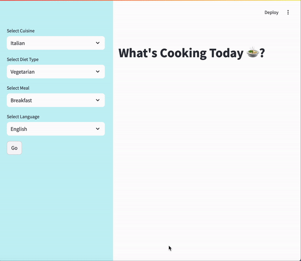

# Create AI-Driven Apps Using LangChain, Streamlit, and Llama 3.1

This project demonstrates the use of **LangChain**, **Ollama's Llama 3.1**, and **Streamlit** to build an interactive recipe generator application. The app fetches dish recipes, allows users to download them as PDFs, and provides share options via email. It also includes integration with Google Serper API for fetching the price links of ingredients.



*Note: A video GIF demonstrating the app in action can be found in the `app_snap` folder.*

## Features

- **Interactive User Interface**: Built with Streamlit for a smooth, interactive experience.
- **LLM Integration**: Uses Ollama's Llama 3.1 model hosted locally for generating recipes.
- **Agent and Tools**: Leveraging LangChain Agents for ingredient price retrieval using Google Serper API.
- **Download & Share**: Users can download recipes in PDF format or share them via email directly from the app.

---
### Medium Article for Detailed Code Explanation

A comprehensive explanation of the code behind this project, including the integration of LangChain, Ollama, and Streamlit, is available on Medium. The article walks through the technical details, and the overall structure of the app. It also covers how local LLMs and agents are used effectively.

Check out the article here: [**Beginner's guide to Building LLM Apps with Langchain**](#)


## Installations

### 1. Virtual Environment Setup

To get started, create a virtual environment to manage your dependencies:

```bash
python3 -m venv llmenv
source llmenv/bin/activate  
# On Windows, use `llmenv\Scripts\activate`
```

### 2. Installing Requirements

Once the virtual environment is activated, install the required dependencies:

```bash
pip install -r requirements.txt
```

This will install all necessary packages, including **LangChain**, **Streamlit**, **FPDF**, and other required libraries.


## Setting Up Llama 3.1 Locally with Ollama

Ollama makes it simple to set up and run large language models like Llama 3.1 on our local machine. Follow the steps below to get started with the Llama 3.1 model.

1. **Download Ollama**:
   First, visit [ollama](https://github.com/ollama/ollama) and download the application suitable for your operating system (macOS, Linux, or Windows).

2. **Install Ollama**:
   After downloading the app, execute the following command in your terminal:
   
   ```bash
   ollama --version
   ```

   This should output the installed version of Ollama, confirming the installation.

3. **Pull the Llama 3.1 Model**:
   To run Llama 3.1, use the following command to pull the latest version of the model:

   ```bash
   ollama pull llama3.1
   ```
 You can replace `"llama3.1"` with any other model listed in the repository.

4. **Verify Model Installation**:
    This command will show all the models you have installed locally, including Llama 3.1.

   ```bash
   ollama list
   ```

5. **Use the Llama 3.1 Model in Your Application**:
   After successfully downloading and verifying the model, integrate it into your application by calling it from the local environment:

   ```python
   from ollama_llm import OllamaLLM

   # Use the locally hosted Llama 3.1 model
   llama_llm = OllamaLLM(model="llama3.1")
   ```
   
## Environment Variables

Before running the app, make sure you set up environment variables, including API keys.

### Example `.env` File

```bash
SERPER_API_KEY=your_serper_api_key_here
google_apikey=your_google_api_key_here
google_engineid=your_custom_search_engine_id_here
SENDGRID_API_KEY=your_sendgrid_api_key_here
```

You can create a `.env` file at the root of your project directory and add the necessary API keys. This ensures that the required keys are securely managed and not hard-coded into your project.

### Reference Links

Here are some links for obtaining API keys:

- **Google Serper API Key:**  
  Required for fetching search results from Google via the Serper API. Visit the link to get your key and check out the setup section for instructions.  
  [Google Serper API Key Documentation](https://python.langchain.com/docs/integrations/providers/google_serper/)

- **SendGrid API Key:**  
  Used for sending emails through the app, such as sharing recipes. Sign up for the free tier to access the API.  
  [SendGrid API Key Documentation](https://sendgrid.com/en-us/solutions/email-api)

- **Google API Key for Image Search:**  
  Needed to fetch images via Google search. Obtain an API key from Google API Console and enable the Custom Search API.  
  [Google API Key Instructions](https://code.google.com/apis/console)

- **Google Programmable Search Engine ID:**  
  Required for integrating Google's programmable search into the app. You can get a search engine ID from the Control Panel.  
  [Google Programmable Search Engine Control Panel](https://programmablesearchengine.google.com/controlpanel/all)

## Running the App

Once the environment is set up, you can run the Streamlit application using:

```bash
streamlit run main.py
```

This will start the application in your browser, where you can select cuisine, diet type, and meal options, and generate a dish along with its ingredients and recipe.

---

## File Structure

The project structure is organized as follows:

```
.
├── agent_manager.py         # Contains the agent and tool setup
├── app_snap/                # Contains a GIF of the app in action
├── extract_ingredients.py   # Module for extracting ingredients from recipe
├── fetch_image.py           # Fetches images for dishes from Google
├── generate_pdf.py          # Handles PDF generation for recipes
├── langchain_helper.py      # Helper functions for LangChain operations
├── main.py                  # Main file to run the app
├── react_prompt.py          # Custom prompt for Llama3.1
├── recipe_generator.py      # LLM-driven recipe generator
├── requirements.txt         # Project dependencies
├── send_email.py            # Module for sending recipe via email
├── session_manager.py       # Manages session states in Streamlit
└── ui_elements.py           # Defines UI elements for the Streamlit app
```

---

## Demo

A visual demonstration of the application can be found in the `app_snap` folder, where a GIF showing how the app works is provided.

---

## Contributions

Feel free to fork this repository and submit pull requests if you want to contribute to improving this project.

---